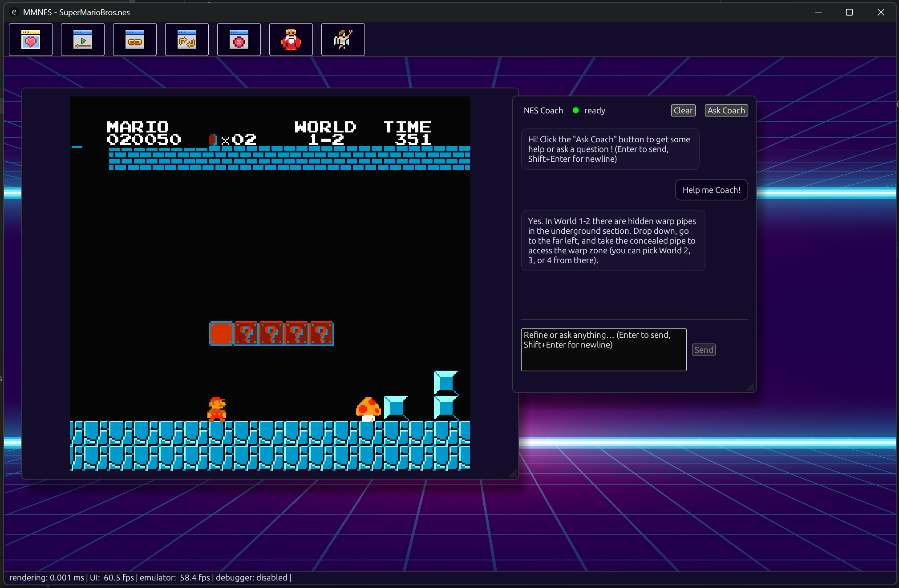
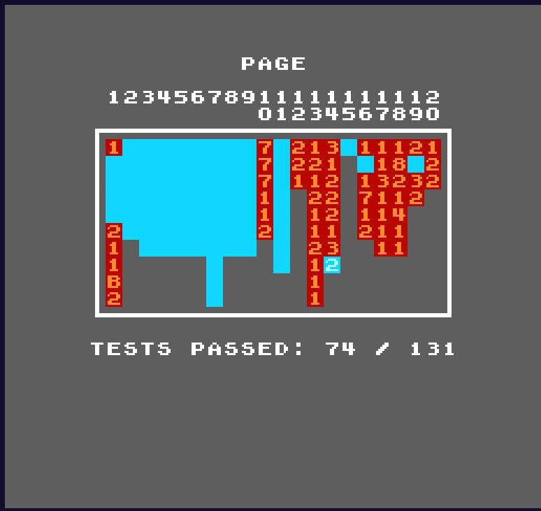

# mmnes - a NES emulator with LLM capabilities

_mmnes_ is a learning-friendly NES emulator. 
It’s not trying to beat the fastest or most accurate emulators; the goal is to **integrate LLM** to help playing and developing for the NES.

> ⚠️ Experimental • Unstable API • For personal use

## Disclaimer

This project is a personal work-in-progress. It is **not intended for use by anyone but me** and is **still under active development**.   

**Notes**: 
- no releases are provided.
- SDL2 is needed

## Why an LLM for a NES emulator ?

By wiring the emulator’s runtime state (CPU/PPU/APU, memory, input, symbols, screenshot) into an LLM, we can:
- **Guide players in real time** (hints, tips, strategy nudges, “what should I try next?”).
- **Help developers debug** by explaining what the code is doing and why things break.

---

## LLM-powered features (ideas & roadmap)

### For players
- **Contextual hints on demand**  
  Press a hotkey to trigger LLM help (“I’m stuck in World 4-2, what now?”)
  The emulator screenshots the screen, and the LLM replies with a hint.
- **Coach**  
  Sample the last few seconds of inputs + game state; the model suggests safer routes, boss patterns, or timing (eg: “wait for the 3-cycles pattern, then jump after the second fireball”).
- **Natural language cheats**  
  “Give me 30 lives,” “Slow down the game 10%,” “Make enemies deal half damage.” The LLM maps requests to emulator features.
- **Auto-achievements summary**  
  After a session, generate a shareable recap: deaths, boss times, secrets found, highlight GIFs.

### For developers
- **Explain the next N instructions**  
  A narrator for 6502: disassemble upcoming opcodes with labels/symbols and get a plain-English summary: control flow, zero-page usage, side effects.
- **Memory analyzer**  
  “Which variables change when the player jumps?” The emulator tags diffs per frame; the LLM suggests candidate addresses and how to set watchpoints.
- **Tiles / sprites debugging by description**  
  “Why is the status bar flickering?” The model inspects OAM/PPU state and explains scanline timing hazards.

---

## Example prompts (internal to emulator)

- Player:
  > “Given: HP=2, lives=1, level=4-2, last deaths: pits x3, inputs show early jumps. Give a gentle hint, then one stronger hint if asked again.”

- Developer:
  > “Explain these 512 instructions relative to labels. Note likely side effects on PPU and which flags get touched.”

## NES Accuracy

We track emulator correctness with **AccuracyCoin**, a very cool single-ROM test suite for NES  (CPU/PPU/APU timing, unofficial opcodes, DMA interactions, sprite 0 hit, etc.).  
_[AccuracyCoin by 100thCoin](https://github.com/100thCoin/AccuracyCoin)_.

**Current score:** `74 / 131`

## Completeness

### CPU
- [x] Official opcodes
- [x] Unofficial opcodes
- [x] NMI/IRQ handling

### PPU
- [x] Background rendering
- [x] Sprites (8 per scanline rule)
- [x] Sprite 0 hit
- [x] VBL/NMI timing
- [ ] Cycle-accurate (permitting mid-scanline updates)
- [ ] Color emphasis
- [ ] Sprite left column enable
- [ ] background left column enable
- [ ] greyscale

### APU
- [x] Pulses, Triangle, Noise
- [x] DMC
- [ ] Filters

### Mappers
- [x] NROM
- [x] UxROM
- [x] MMC1
- [ ] MMC2
- [ ] MMC3

### I/O
- [x] Controller 1
- [ ] Controller 2
- [ ] Others ...

### Others
- [ ] Save states
- [ ] Rewind
- [ ] PRG ram persistency
- [ ] Regionalization (NTSC, PAL, Dendy)

### Debugging
- [x] CPU disassembler
- [ ] Breakpoints & watchpoints
- [ ] Memory inspector
- [ ] PPU visualizer
- [ ] APU visualizer

### LLM Integration
- [ ] Snapshot and hint overlay (✨*in progress*✨)
- [ ] Explain next N instructions
- [ ] Natural-language cheats
- [ ] Session recap

