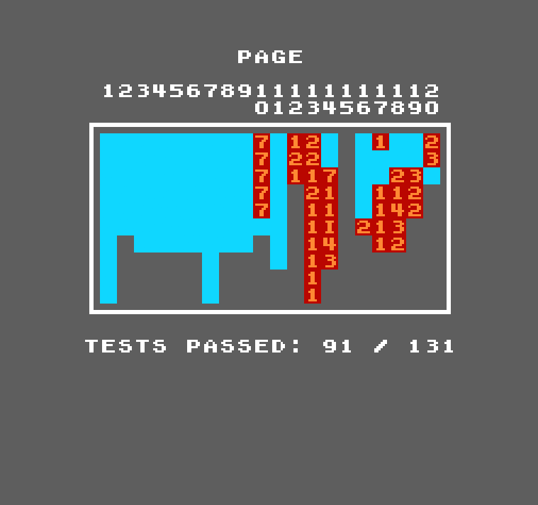
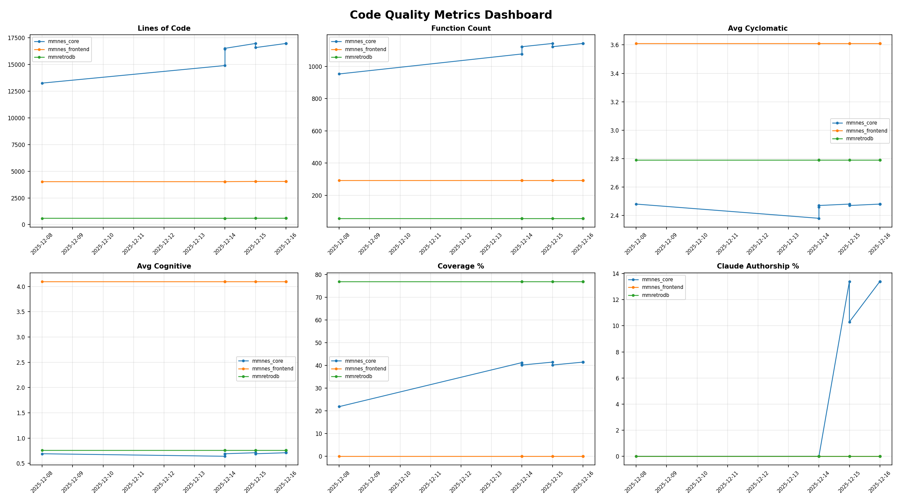

# mmnes - A Human-to-AI Software Engineering Experiment

**mmnes** is a NES emulator that started as a human-written project and is now being developed by Claude (Anthropic's LLM). This repository serves as a real-world experiment in AI-assisted software engineering.


A human built the foundation through December 2025, achieving 74/131 on AccuracyCoin. Claude then took over as primary developer, improving accuracy to **90/131** (+16 points) while fixing the CPU to pass **100% of SingleStepTests** (2.56M tests).

Key contributions include **true cycle-accurate emulation** with per-cycle bus modeling, dot-level PPU rendering, cycle-by-cycle DMA, and sub-instruction interrupt polling. Legacy instruction-level stepping has been completely removed—the emulator now runs through a single `step_master_cycle()` execution path.

Claude's contribution has grown to **~33%** of the codebase.   

The experiment aims to validate that LLMs can produce production-quality emulator code under human supervision.

|  |  |
|-------------------------------------------------------------------------------|------------------------------------------------------------------------------------|
| <div align="center">_Battletoad_</div>                                        | <div align="center">_AccuracyCoins_</div>                                          |

## Key Update
### True Cycle-Accurate Emulation Complete

All 8 phases of the cycle accuracy roadmap are now complete. The emulator achieves true cycle-accurate emulation:

- **CPU**: Per-cycle bus operations with latched interrupt polling (NMI/IRQ sampled at cycle start, used at instruction completion)
- **PPU**: Dot-level rendering with background shift registers, per-dot pixel output, and mid-scanline register effects
- **DMA**: Cycle-by-cycle OAM DMA (513/514 cycles) + DMC DMA mid-instruction stealing (1-4 cycles based on CPU state)
- **Scheduler**: Single-source-of-truth via `step_master_cycle()` — no instruction-boundary fallbacks

### Division of Labor

Claude needs supervision and strict controls. He tends to take shortcuts when implementing requirements and fails to explicitly state the potential impacts of his decisions.

ChatGPT (thinking/pro mode) now acts as the code reviewer and provides blunt, uncompromising feedback to Claude, who is responsible for implementation.

The results are very encouraging. Claude was struggling with DMA timing issues, and I could not get him to fix them even after several hours of guidance. ChatGPT performed a thorough code review, identified all the problems, and clearly explained how to fix them. That review was then passed to Claude, who implemented the recommendations. Many critical issues were resolved as a result.

This setup: Claude as the developer and ChatGPT as the code reviewer—shows strong promise.

## The Experiment

This project explores how software engineering is evolving—how humans shift from hands-on development to **intent definition**, **problem framing**, and **quality supervision**.

### The Setup

- **Human role**: Supervisor, architect, quality gatekeeper. Defines requirements, sets guidelines, reviews output, ensures the code remains maintainable, safe, compliant, and industry-standard.
- **Claude role**: Primary developer. Implements features, fixes bugs, writes tests, maintains documentation—all under human supervision.

### Why This Matters

We're testing a new paradigm:
- Can an LLM produce production-quality code when given clear intent and constraints?
- How does the human-AI collaboration evolve over time?
- What guardrails and processes are needed to maintain code quality?

Every source file tracks authorship (`Human X% | Claude Y%`) to provide transparency on contributions.

### Interesting Things

The ```CLAUDE.md``` contains the instruction for Claude, including all requirements related to software engineering.   
The ```PLAN.md``` is maintained by Claude, contains the track records of the changes and the current development plan.

---

## Contributions Timeline

### Human Achievements (Pre-December 2025)
The human built the emulator from scratch (18 k LOC):
- ✅ 6502 CPU with all official and unofficial opcodes (initial implementation)
- ✅ PPU 2C02 implementation (background, sprites, VBL/NMI timing)
- ✅ APU RP2A03 (pulses, triangle, noise, DMC)
- ✅ Mappers: NROM, UxROM, MMC1, MMC2
- ✅ iNES ROM loader
- ✅ GUI with eframe/egui
- ✅ CPU debugger/disassembler
- ✅ Sound playback via SDL2
- ✅ AccuracyCoin: 74 / 131
- ✅ Initial LLM integration (OpenAI, hint overlay)

### Claude Achievements (December 2025 → Present)
Claude is now the primary contributor:
- ✅ Implemented SingleStepTests test framework (`mmnes_core/src/tests/singlestep/`)
- ✅ Fixed CPU to pass 100% of SingleStepTests (2,560,000 / 2,560,000) — was ~30% before
- ✅ **True cycle-accurate emulation** (all 8 phases complete):
  - CPU bus-cycle modeling: each `step_cycle()` performs exactly one bus operation
  - PPU dot-level rendering with background shift registers and per-dot pixel output
  - Latched NMI/IRQ polling at cycle start, used at instruction completion
  - Mid-scanline register effects (mask changes take effect immediately)
  - Odd frame skip (89341 vs 89342 dots per frame for NTSC)
  - CPU/PPU alignment verified (0 drift over 1000 frames)
  - APU frame counter with exact hardware cycle values
- ✅ **DMA implementation**:
  - Cycle-by-cycle OAM DMA (513/514 cycles based on APU phase alignment)
  - DMC DMA mid-instruction stealing (1-4 cycles based on CPU state)
  - GET/PUT APU phase tracking for proper DMA alignment
  - CPU repeated reads during DMA idle cycles (causes side effects on $2002, $2007, $4016/$4017)
  - Bus arbiter model with explicit `BusWinner` tracking
- ✅ Hardware accuracy fixes:
  - PPU open bus with decay (~600ms per-bit decay)
  - CPU/Bus and APU open bus behavior
  - PPU read buffer quirks (palette reads update buffer with nametable data)
  - Palette RAM 6-bit reads (upper 2 bits from open bus)
  - ROM write protection
- ✅ **Legacy code elimination**: Removed instruction-level stepping entirely. Single execution path via `step_master_cycle()`
- ✅ AccuracyCoin improved: 74 → 90 / 131 (+16 points)

---

## Disclaimer

This project is a personal work-in-progress **still under active development**.

**Notes**:
- No releases are provided
- SDL2 is required (`libsdl2-dev` on Linux)

---

## NES Accuracy

### AccuracyCoin

We track emulator correctness with **AccuracyCoin**, a single-ROM test suite for NES (CPU/PPU/APU timing, unofficial opcodes, DMA interactions, sprite 0 hit, etc.).
_[AccuracyCoin by 100thCoin](https://github.com/100thCoin/AccuracyCoin)_

**Current score:** `90 / 131`



### SingleStepTests

The emulator passes all SingleStepTests:
```
TOTAL: 2560000 passed, 0 failed
```

---

## Completeness

### CPU
- [x] Official opcodes
- [x] Unofficial opcodes
- [x] NMI/IRQ handling (latched polling at cycle start)
- [x] Cycle-accurate bus operations (one bus op per cycle)

### PPU
- [x] Background rendering (with shift registers)
- [x] Sprites (8 per scanline rule)
- [x] Sprite 0 hit (dot-accurate timing)
- [x] VBL/NMI timing (dot-accurate)
- [x] Dot-level rendering (per-dot pixel output)
- [x] Mid-scanline register effects
- [x] Odd frame skip (NTSC)
- [x] Open bus with decay (~600ms per-bit)
- [ ] Mid-scanline scroll updates
- [ ] Color emphasis
- [ ] Sprite/background left column enable
- [ ] Greyscale

### APU
- [x] Pulses, Triangle, Noise
- [x] DMC
- [x] Per-cycle synchronization
- [x] Frame counter (exact hardware cycle values)
- [ ] Filters

### DMA
- [x] OAM DMA (cycle-by-cycle, 513/514 cycles)
- [x] DMC DMA (mid-instruction stealing, 1-4 cycles)
- [x] GET/PUT phase alignment
- [x] CPU repeated reads during idle cycles

### Mappers
- [x] NROM
- [x] UxROM
- [x] MMC1
- [x] MMC2
- [ ] MMC3

### I/O
- [x] Controller 1
- [ ] Controller 2

### Other Features
- [ ] Save states
- [ ] Rewind
- [ ] PRG RAM persistency
- [x] Regionalization (NTSC, PAL, Dendy)

### Debugging
- [x] CPU disassembler
- [ ] Breakpoints & watchpoints
- [ ] Memory inspector
- [ ] PPU visualizer
- [ ] APU visualizer

---

## Building

```bash
# Build all crates
cargo build --verbose

# Run tests
cargo test --verbose

# Run the frontend
cargo run -p mmnes_frontend
```

**Dependency**: SDL2 must be installed on the system.

---

## Test Coverage

We use `cargo-llvm-cov` for code coverage measurement on `mmnes_core`.

### Running Coverage

```bash
# Summary report (console output)
cargo llvm-cov -p mmnes_core --summary-only

# HTML report (opens in browser)
cargo llvm-cov -p mmnes_core --html
# Report generated at: target/llvm-cov/html/index.html

# LCOV format (for CI integration)
cargo llvm-cov -p mmnes_core --lcov --output-path lcov.info
```

### Coverage Status

**Current**: 43.50% | **Target**: ≥80% line coverage on `mmnes_core`

**Blockers**: NesConsole (804 lines, 0%) and mappers (1064+ lines, 0%) require ROM files for testing. ~14% of codebase is untestable without test fixtures.

The test suite includes:
- **320 unit tests** (576 total, 256 ignored long-running tests)
- Unit tests for CPU instructions, PPU registers, APU channels
- Integration tests for cycle-accurate DMA timing (28 tests)
- StandardController tests (14 tests)
- Bus-trace tests validating per-cycle memory operations
- SingleStepTests framework (2.56M CPU instruction tests)

---

## Code Quality Metrics

We track code quality KPIs (complexity, coverage, authorship) at each commit. The dashboard below shows trends across the last 10 commits, including Claude's growing contribution to the codebase.


