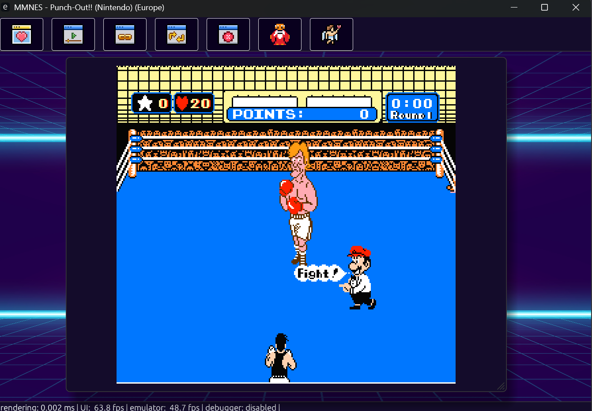
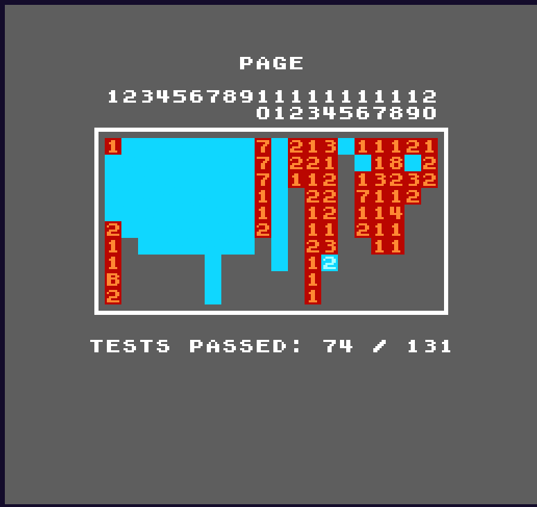

# mmnes - A Human-to-AI Software Engineering Experiment

**mmnes** is a NES emulator that started as a human-written project and is now being developed by Claude (Anthropic's LLM). This repository serves as a real-world experiment in AI-assisted software engineering.

> ⚠️ Experimental • Unstable API • For personal use



## The Experiment

This project explores how software engineering is evolving—how humans shift from hands-on development to **intent definition**, **problem framing**, and **quality supervision**.

### The Setup

- **Human role**: Supervisor, architect, quality gatekeeper. Defines requirements, sets guidelines, reviews output, ensures the code remains maintainable, safe, compliant, and industry-standard.
- **Claude role**: Primary developer. Implements features, fixes bugs, writes tests, maintains documentation—all under human supervision.

### Why This Matters

We're testing a new paradigm:
- Can an LLM produce production-quality code when given clear intent and constraints?
- How does the human-AI collaboration evolve over time?
- What guardrails and processes are needed to maintain code quality?

Every source file tracks authorship (`Human X% | Claude Y%`) to provide transparency on contributions.

---

## Contributions Timeline

### Human Achievements (Pre-December 2025)
The human built the emulator from scratch:
- ✅ 6502 CPU with all official and unofficial opcodes (initial implementation)
- ✅ PPU 2C02 implementation (background, sprites, VBL/NMI timing)
- ✅ APU RP2A03 (pulses, triangle, noise, DMC)
- ✅ Mappers: NROM, UxROM, MMC1, MMC2
- ✅ iNES ROM loader
- ✅ GUI with eframe/egui
- ✅ CPU debugger/disassembler
- ✅ Sound playback via SDL2
- ✅ AccuracyCoin: 74 / 131
- ✅ Initial LLM integration (OpenAI, hint overlay)

### Claude Achievements (December 2025 → Present)
Claude is now the primary contributor:
- ✅ Implemented SingleStepTests test framework (`mmnes_core/src/tests/singlestep/`)
- ✅ Fixed CPU to pass 100% of SingleStepTests (2,560,000 / 2,560,000) — was ~30% before
- 🔄 *More to come...*

---

## Disclaimer

This project is a personal work-in-progress **still under active development**.

**Notes**:
- No releases are provided
- SDL2 is required (`libsdl2-dev` on Linux)

---

## NES Accuracy

### AccuracyCoin

We track emulator correctness with **AccuracyCoin**, a single-ROM test suite for NES (CPU/PPU/APU timing, unofficial opcodes, DMA interactions, sprite 0 hit, etc.).
_[AccuracyCoin by 100thCoin](https://github.com/100thCoin/AccuracyCoin)_

**Current score:** `74 / 131`



### SingleStepTests

The emulator passes all SingleStepTests:
```
TOTAL: 2560000 passed, 0 failed
```

---

## Completeness

### CPU
- [x] Official opcodes
- [x] Unofficial opcodes
- [x] NMI/IRQ handling

### PPU
- [x] Background rendering
- [x] Sprites (8 per scanline rule)
- [x] Sprite 0 hit
- [x] VBL/NMI timing
- [ ] Cycle-accurate (mid-scanline updates)
- [ ] Color emphasis
- [ ] Sprite/background left column enable
- [ ] Greyscale

### APU
- [x] Pulses, Triangle, Noise
- [x] DMC
- [ ] Filters

### Mappers
- [x] NROM
- [x] UxROM
- [x] MMC1
- [x] MMC2
- [ ] MMC3

### I/O
- [x] Controller 1
- [ ] Controller 2

### Other Features
- [ ] Save states
- [ ] Rewind
- [ ] PRG RAM persistency
- [x] Regionalization (NTSC, PAL, Dendy)

### Debugging
- [x] CPU disassembler
- [ ] Breakpoints & watchpoints
- [ ] Memory inspector
- [ ] PPU visualizer
- [ ] APU visualizer

---

## Building

```bash
# Build all crates
cargo build --verbose

# Run tests
cargo test --verbose

# Run the frontend
cargo run -p mmnes_frontend
```

**Dependency**: SDL2 must be installed on the system.
